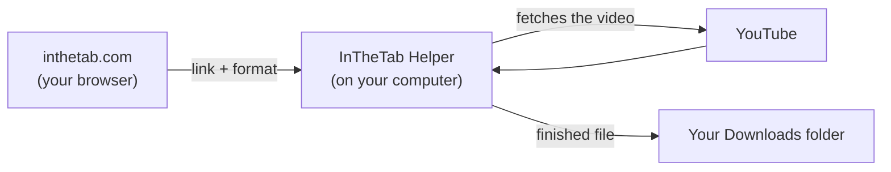

# InTheTab Helper

A small app for Mac and Windows that lets the [InTheTab YouTube downloader](https://inthetab.com/youtube-downloader/) save videos as MP4 or MP3. The download happens on your own computer. InTheTab never sees your links or your videos.

**[Download the latest version](https://github.com/karwasandesh/inthetab-helper/releases/latest)**

| Your computer | File |
|---|---|
| Mac (Apple Silicon or Intel, macOS 11 or later) | `InTheTab-Helper.dmg` |
| Windows 10 or 11 (64-bit) | `InTheTab-Helper.exe` |

Phones and tablets aren't supported.

## Why there's an app

Browsers don't let a website fetch video files from YouTube, so no web page can download them by itself. Most online downloaders get around this by downloading the video on *their* server and then sending it to you, which means they see every link you save.

The helper does that step on your computer instead:

- The web page only sends the link to the helper on your own machine (`127.0.0.1`).
- The helper downloads the video with [yt-dlp](https://github.com/yt-dlp/yt-dlp) and joins the video and sound with [ffmpeg](https://ffmpeg.org).
- Your browser then saves the finished file. The helper deletes its own copy as soon as the browser has it.

## Install on a Mac

1. Download `InTheTab-Helper.dmg`, open it, and drag **InTheTab Helper** into **Applications**.
2. Open **InTheTab Helper** from Applications.
3. The app isn't signed with an Apple Developer certificate yet, so the first time macOS says it *"could not verify"* the app. Click **Done** (not *Move to Bin*).
4. Open **System Settings → Privacy & Security**, scroll down to the message about InTheTab Helper, and click **Open Anyway**. Confirm with your password or Touch ID.
5. The InTheTab downloader page opens in your browser. On first run the helper downloads yt-dlp and ffmpeg (about 170 MB), which takes a minute.

You only do steps 3–4 once. The helper runs in the background with no Dock icon. To stop it, click **Quit helper** on the downloader page.

## Install on Windows

1. Download `InTheTab-Helper.exe` and double-click it.
2. The app isn't code-signed yet, so Windows may show *"Windows protected your PC"*. Click **More info**, then **Run anyway**.
3. The InTheTab downloader page opens in your browser. On first run the helper downloads yt-dlp, ffmpeg and Node.js (about 140 MB), which takes a minute or two.

The helper runs in the background with no window. To stop it, click **Quit helper** on the downloader page.

## Using it

1. Start **InTheTab Helper** (it opens the downloader page for you), or go to [inthetab.com/youtube-downloader](https://inthetab.com/youtube-downloader/) while it's running.
2. Paste a YouTube link, choose **Best quality**, **1080p**, **720p** or **Audio only (MP3)**, and click **Download**.
3. The file lands in your browser's usual Downloads folder.

Videos are saved as H.264 + AAC MP4 when YouTube offers it, so they play in QuickTime, Windows Media Player, on TVs and on phones.

Chrome and Edge may ask once whether inthetab.com may *"access other apps and services on this device"*. Click **Allow**: that's the page talking to the helper.

## Privacy and security

- **Nothing goes through InTheTab's servers.** The page talks only to the helper on your computer, and the helper talks only to YouTube and to the download sources below.
- **Only InTheTab can use it.** The helper listens on `127.0.0.1:47213`, so it can't be reached from other computers on your network. It refuses requests from any website other than inthetab.com.
- **Only video links are accepted.** Each link is checked against an allow-list of sites before yt-dlp sees it, and it can never be read as a command-line option.
- **Verified downloads.** On first run the helper fetches its tools from their official sources and checks every file against its published SHA-256 checksum. If a check fails, the file is thrown away.
  - yt-dlp: [github.com/yt-dlp/yt-dlp](https://github.com/yt-dlp/yt-dlp/releases)
  - ffmpeg for Mac: [ffmpeg.martin-riedl.de](https://ffmpeg.martin-riedl.de)
  - ffmpeg for Windows: [github.com/yt-dlp/FFmpeg-Builds](https://github.com/yt-dlp/FFmpeg-Builds/releases)
  - Node.js (Windows only): [nodejs.org](https://nodejs.org/dist/)
- **Self-updating.** YouTube changes often, so the helper runs `yt-dlp -U` each time it starts to pick up fixes.
- Each release lists SHA-256 checksums for the installers in `SHA256SUMS.txt`.

Only download videos you have the right to save, such as your own uploads or videos with a licence that allows it. Downloading may be against YouTube's Terms of Service.

## Troubleshooting

| What you see | What to do |
|---|---|
| The page says the helper isn't running | Start InTheTab Helper again. If it's already running, reload the page. |
| Chrome or Edge blocked the connection | Click the icon at the left of the address bar, allow access to apps on this device, then reload. |
| Safari can't reach the helper | Use Chrome, Edge, Firefox or Brave for the downloader. |
| "Sign in to confirm you're not a bot" | YouTube is limiting your connection. Wait a while, or switch networks. |
| A download fails right after a YouTube change | Quit the helper and start it again: it updates yt-dlp on start. |
| Setup failed on first run | Check your internet connection, then quit and restart the helper to retry. |

The Mac log is at `~/Library/Logs/InTheTab Helper.log`.

## Uninstall

**Mac:** click **Quit helper** on the downloader page, move **InTheTab Helper** from Applications to the Bin, then delete `~/Library/Application Support/InTheTab Helper` and `~/Library/Logs/InTheTab Helper.log`.

**Windows:** click **Quit helper** on the downloader page, delete `InTheTab-Helper.exe`, then delete the folder `%LOCALAPPDATA%\InTheTab Helper`.

## About this repository

This repository only hosts the helper's releases and documentation. The helper is plain JavaScript running on [Node.js](https://nodejs.org), and you can read it inside the app. Third-party software is listed in [THIRD-PARTY-NOTICES.md](THIRD-PARTY-NOTICES.md).

Questions or problems: [open an issue](https://github.com/karwasandesh/inthetab-helper/issues) or email karwa.sandesh@gmail.com.
